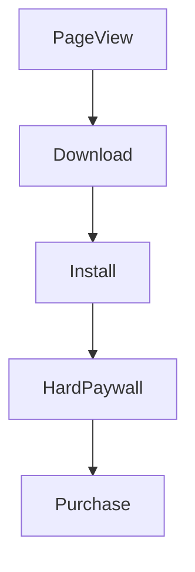

# User Funnel Analysis Case Study

This repository contains a comprehensive case study and solution for a user funnel analysis project, including dataset generation, SQL implementation, data modeling considerations, and visualization recommendations.

---

## User Events Funnel Flow

*The funnel tracks user progression through key events within 72 hours between each step.*

---

## Data Model

**Table: `user_events`**

| Column      | Type          | Description                                      |
|-------------|---------------|------------------------------------------------|
| event_id    | VARCHAR(255)  | Unique event identifier                          |
| user_id     | VARCHAR(255)  | Unique user identifier                           |
| event_name  | ENUM          | Event type (`PageView`, `Download`, `Install`, `HardPaywall`, `Purchase`) |
| platform    | ENUM          | Platform (`ios`, `android`)                      |
| device_type | VARCHAR(255)  | Device type (`Phone`, `Tablet`, etc.)            |
| timestamp   | TIMESTAMP     | Event timestamp                                 |

---

## Funnel Analysis Metrics (Sample)

| Platform | Total Users | Pageviews | Downloads | Installs | PageView → Download (%) | Download → Install (%) |
|----------|-------------|-----------|-----------|----------|------------------------|-----------------------|
| iOS      | 480         | 480       | 385       | 351      | 80.21                  | 91.17                 |
| Android  | 520         | 520       | 422       | 373      | 81.15                  | 88.39                 |

---

## Contents

- **UserFunnelAnalysisMetrics.csv**  
  Funnel analysis results with conversion counts and rates by platform.

- **userevents1.sql**  
  SQL script to create the events table, load the dataset, and perform funnel analysis.

- **userevents.ipynb**  
  Jupyter Notebook for generating synthetic user event data and preliminary exploration.

- **Answers.pdf**  
  Detailed explanations and answers covering data generation, SQL queries, data modeling, and visualization recommendations.

---

## Summary

- Generated a synthetic dataset simulating a user funnel: `PageView` → `Download` → `Install` → `HardPaywall` → `Purchase`.
- Developed SQL queries to analyze conversion rates, only considering steps within 72 hours.
- Proposed a scalable data model and partitioning strategies suitable for production.
- Recommended visualization tools including Power BI, Tableau, and Python libraries for flexible dashboarding.
- Suggested additional metrics such as time between events and churn rate for deeper funnel insights.

---

*This project demonstrates an end-to-end approach to funnel analysis, from data generation to actionable business insights.*

---
